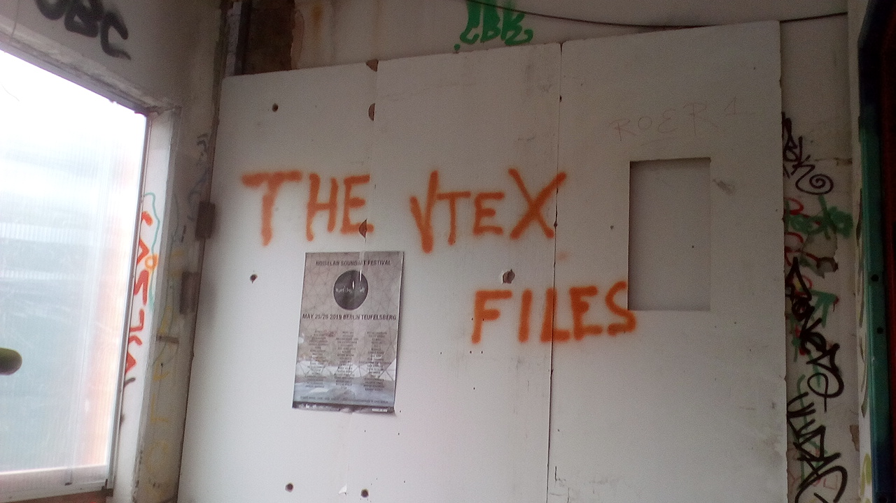

# the-vtex-files.github.io
<<<<<<< HEAD
Work in progress.
=======
**The VteX Files** is an experimental action RPG set on moon VteX, a rather hostile environment, where players face an abyss full of horrors. In the process, this tale of out-of-control capitalism, inter-dimensional surveillance and space-time distortion becomes strangely and poignantly relatable.
From the first person perspective, you experience the daily struggles of 21st century archetypes Charlie Hanson and John Dyson, battered employees in the farming and military sector. Slip into the roles of existing characters, develop, or invent new ones, go into combat with mythical creatures or appropriate technocapitalism, how to approach complexities on VteX is up to you.

Every generic capability you possess will come in handy when roaming the bruised soil of VteX. Curiosity, intuition or creative problem solving are most valuable assets in this thought-provoking strategy game, but in order to perform tactical operations like robot slaying, it is vital to keep a cool head, take heart and leave the beaten track. 
Writing  with your gut, making tools for communication or navigation, solving cryptographic puzzles --
throughout the game you will be challenged to build upon existing knowledge. Every slight modification provokes a surprising change of game, whether it be the realization of new ideas or playing across cultures, squads, lifestyles and disciplines. Its dynamics adapt to those of life, which is neither static nor deterministic, but a constant work-in-progress, where starting point or outcome are random.

Hand the futile task of engineering a future over to the forces of desire! Clone and get your licence to speed!
The game does not [directly](https://www.patreon.com/c_jaeger) pursue commercial interests but wants to promote the free flow of information.
[Get in touch](mailto:ca_jaeger@protonmail.com) for any questions you might have, feedback is greatly appreciated. 

>>>>>>>develop
